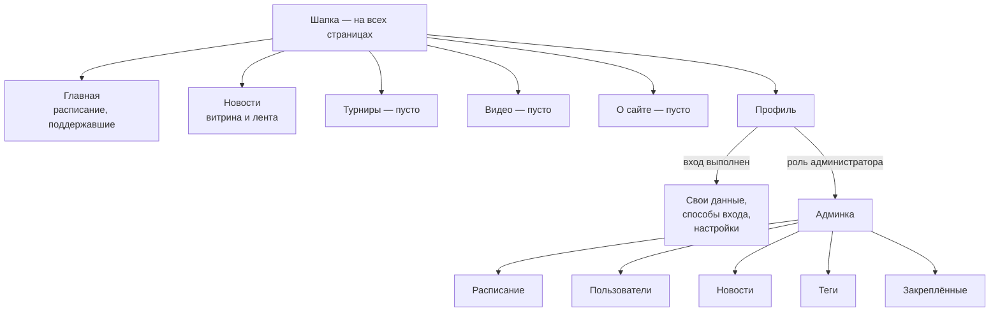
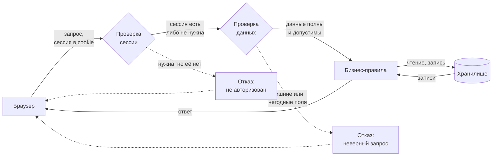
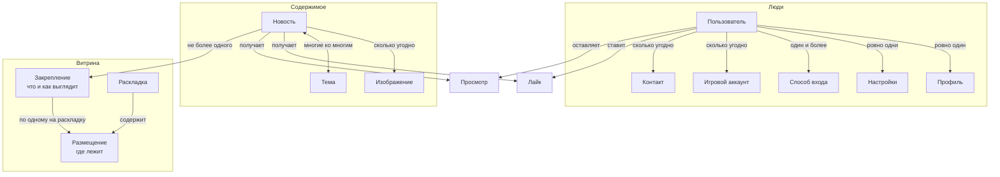

# ОБЩ — Общее

**Состояние**: Черновик
**Создана**: 2026-08-11
**Реестр блоков**: [.specify/memory/blocks-registry.md](../../.specify/memory/blocks-registry.md)

Корневой документ: что это за система, для кого, из чего сделана и по каким правилам живёт. Остальные спеки описывают отдельные страницы и **ссылаются сюда**, а не переписывают общие правила у себя.

## Оглавление

**Описательная часть**

- [Назначение](#назначение)
- [Аудитория](#аудитория)
- [Устройства и экраны](#устройства-и-экраны)
- [Устройство системы](#устройство-системы)
- [Карта сайта](#карта-сайта)
- [Путь запроса](#путь-запроса)
- [Модель предметной области](#модель-предметной-области)
- [Жизненный цикл сессии](#жизненный-цикл-сессии)
- [Поведение при отказах](#поведение-при-отказах)
- [Словарь](#словарь)
- [Соглашения](#соглашения)

**Нормативная часть**

- [Требования](#требования)
  - [АРХ — Архитектура и стек](#арх--архитектура-и-стек)
  - [АВТ — Авторизация и сессии](#авт--авторизация-и-сессии)
  - [АДП — Адаптив](#адп--адаптив)
  - [БЕЗ — Безопасность](#без--безопасность)
  - [ДСТ — Доступность](#дст--доступность)
  - [ФАЙ — Файлы](#фай--файлы)
  - [ШАП — Шапка и навигация](#шап--шапка-и-навигация)
  - [ИНТ — Внешние интеграции](#инт--внешние-интеграции)
  - [ПСТ — Поставка и окружение](#пст--поставка-и-окружение)
- [Что ещё не построено](#что-ещё-не-построено)
- [Сводка расхождений по всему проекту](#сводка-расхождений-по-всему-проекту)
- [Принятые решения](#принятые-решения)

## Назначение

**steramer.io — персональный сайт стримера.** Его задача: собрать вокруг вещания постоянную аудиторию и дать ей одно место, где видно всё существенное о проекте — когда будут эфиры, что произошло за последнее время, кто поддерживает проект.

Продукт решает три задачи владельца:

1. **Объявлять.** Расписание эфиров и новости проекта в одном месте, которое не теряется в ленте соцсети и не зависит от чужих алгоритмов.
2. **Удерживать.** Зритель возвращается на сайт, а не только на площадку вещания: у него есть учётная запись, отметки прочитанного, реакции.
3. **Управлять самому.** Всё содержимое наполняется через собственную панель управления, без разработчика и без правки кода.

Что продукт **не** решает: не является площадкой вещания (эфир идёт на внешнем сервисе), не является форумом или чатом, не продаёт ничего напрямую.

## Аудитория

| Кто | Сколько | Что делает |
|---|---|---|
| **Гость** | основная масса | Читает, смотрит расписание, ничего не оставляет о себе |
| **Зритель** | зарегистрированные | То же плюс реакции, история прочитанного, свой профиль |
| **Владелец** | один человек | Наполняет содержимое, разграничивает доступ |

**Асимметрия существенна.** Читающих много, пишущих — практически один. Отсюда следствия, проходящие через всю систему: административная часть оптимизируется под удобство, а не под масштаб; одновременное редактирование одного и того же не разграничивается; публичная часть должна выдерживать наплыв, административная — нет.

## Устройства и экраны

Сайт открывают с чего угодно: с телефона, с планшета — и книжкой, и альбомом, — с ноутбука и с большого монитора. Ни один из этих случаев не объявляется второстепенным: неудобный на телефоне сайт теряет ровно ту аудиторию, ради которой он существует, потому что ссылку на новость чаще всего открывают из мессенджера на телефоне.

**Отправная точка — форма окна, а не устройство.** Браузер не сообщает, что он «на планшете»: он сообщает ширину, высоту и ориентацию. Это не обходной путь, а более верная модель — окно браузера, растянутое на половину монитора, по форме и есть планшет, и вести себя обязано так же. Поэтому вся классификация ниже — про окно.

**Ширины мало, нужна ориентация.** По одной ширине планшет книжкой от планшета альбомом не отличить: iPad Pro книжкой — 1024 точки, шире, чем обычный планшет альбомом. Ширина отвечает на вопрос «сколько влезет в строку», ориентация — на вопрос «как человек держит устройство и куда он тянется пальцем».

**И высоты тоже.** Телефон, повёрнутый боком (~844×390), по ширине выглядит как планшет альбомом, но под содержимое остаётся около двухсот пятидесяти точек по вертикали. Многоколоночная компоновка там нечитаема. Без условия по высоте телефон боком получил бы десктопный вид — это уже случалось и было исправлено.

### Классы компоновки

| Класс | Форма окна | Типичное устройство | Смысл |
|---|---|---|---|
| **Компактная** | узкое либо книжное | Телефон в любой ориентации, планшет книжкой | Одна колонка, вспомогательное убрано за вызов |
| **Средняя** | альбомное, но невысокое и неширокое | Планшет альбомом, окно в половину экрана | Многоколоночность есть, но плотность и отступы умереннее десктопных |
| **Широкая** | широкое | Ноутбук, монитор | Полный вид, ради которого рисовались макеты |
| **Широкая + центрирование** | очень широкое | Большой монитор | То же, но содержимое перестаёт растягиваться и встаёт по центру |

Центрирование — не четвёртый класс, а режим широкого: состав и расположение блоков те же, ограничена лишь предельная ширина. Без этого предела строка текста на большом мониторе становится нечитаемо длинной, а шапка расходится с содержимым страницы по левому краю.

**Компоновка не меняет состав возможностей.** Всё, что можно сделать на широком экране, доступно и на компактном. Меняется расположение и способ вызова — боковая панель становится выезжающей снизу, ряд кнопок сворачивается в меню, — но не список того, что человек может сделать.

**Компоновка страницы и раскладка витрины — разные вещи**, и их регулярно путают. Раскладок витрины две, и это сознательное ограничение: каждая требует от владельца отдельной ручной расстановки закреплений (см. [АЗК](../02-admin/05-pinned/spec.md#принятые-решения)). Компоновок три, потому что они ручного труда не создают вовсе — их обслуживает вёрстка. Средняя и широкая компоновки пользуются одной и той же, широкой раскладкой витрины.

Из этого следует третья, отдельная величина: **где стоит боковая панель**. Она не выводится ни из компоновки, ни из раскладки, а зависит от того, остаётся ли главному блоку страницы его минимальная ширина. Панель уезжает вниз, как только перестаёт — при неизменных компоновке и раскладке. Смешение этих трёх понятий уже приводило к тому, что на планшете альбомом витрине оставалось около сотни точек ширины: раскладка выбиралась широкая, а панель одновременно занимала место, рассчитанное на монитор.

## Устройство системы

### Три репозитория

| Репозиторий | Роль |
|---|---|
| `steramer.io` | Зонтичный: спецификации, конвенции, исходники макетов, указатели на остальные два |
| `streamer.API` | Серверная часть |
| `stream.Front` | Клиентская часть |

Серверная и клиентская части — самостоятельные репозитории со своей историей. Зонтичный хранит указатели на их состояния, поэтому по нему восстанавливается любой момент в прошлом целиком.

### Клиент и сервер

Разделены полностью: сервер отдаёт данные, клиент рисует. Сервер не знает о вёрстке, клиент не знает о хранилище. Единственная точка соприкосновения — интерфейс обмена данными.

Практическое следствие видно в спеках: у каждого функционального блока требования разложены по слоям, и слой `Б` не зависит от слоя `Ф`. Правило, помеченное `О`, обязано выполняться независимо от того, кто его исполняет — это защита от ситуации, когда проверка есть только в интерфейсе и обходится прямым обращением к серверу.

### Стек

Выбор зафиксирован и не пересматривается от задачи к задаче.

| Слой | Чем |
|---|---|
| Серверная часть | NestJS 11, TypeScript |
| Хранилище | MySQL / MariaDB через Prisma 7 |
| Клиентская часть | Angular 22, TypeScript 6, PrimeNG 22, Angular CDK |
| Проверка клиента | Vitest, Storybook |
| Проверка сервера | Jest |
| Настольные и мобильные сборки | Electron — **запланирован, не реализован** |
| Источник дизайна | Выгрузки из Figma в зонтичном репозитории |

Клиентская часть работает **без серверного рендеринга**: страницы собираются в браузере. Это решение с последствиями — см. [Принятые решения](#принятые-решения).

## Карта сайта

Сайт делится на три зоны по уровню доступа. Граница между ними — не оформление, а проверка на сервере: скрытый в интерфейсе пункт меню защитой не является.

Верхний ряд доступен всем без входа. Профиль требует сессии, админка — вдобавок роли администратора. Три раздела объявлены в навигации, но не наполнены. Пять разделов управления вложены в админку: у них общее разграничение доступа и общее поведение таблиц.

## Путь запроса

Каждое обращение проходит одни и те же ступени. Понимание этой последовательности объясняет, почему требования разделены на слои: ступени принадлежат разным слоям и отказывают по-разному.

**Проверка сессии** решает, кто обращается. Часть разделов обслуживает и гостя, и вошедшего: отсутствие сессии там не отказ, а признак «показать общедоступный вариант».

**Проверка данных** отсекает негодное до того, как оно дойдёт до правил. Поля, не предусмотренные запросом, отклоняются, а не отбрасываются молча — иначе ошибка клиента и попытка подмены выглядят одинаково успешными.

**Бизнес-правила** — единственная ступень, знающая, что означают данные. Только здесь решается, можно ли администратору удалить самого себя или закрепить новость в занятую ячейку.

**Хранилище** не содержит логики: структура задаётся описанием, изменяется порождёнными из него шагами и не правится напрямую.

## Модель предметной области

Три несвязанные группы сущностей. Отсутствие связей между ними — тоже сведение: расписание живёт само по себе, а витрина не зависит от того, кто что читал.

**Люди.** У аккаунта ровно один профиль и одни настройки, но сколько угодно способов входа: пароль и внешний поставщик существуют одновременно, поэтому потеря доступа к одному не отрезает от аккаунта.

**Содержимое.** Лайк и просмотр — не свойства новости, а отдельные связи «этот человек и эта новость». Отсюда и возможность спросить «что я уже читал», и невозможность накрутить счётчик повторным открытием.

**Витрина.** Разделена намеренно: закрепление отвечает за «что и как выглядит» и существует в одном экземпляре, размещение — за «где лежит» и существует по одному на раскладку. До разделения то и другое дублировалось на каждую раскладку и расходилось.

**Расписание** в схему не попало, потому что ни с чем не связано: семь неизменных записей, по одной на день недели.

## Жизненный цикл сессии

Человек входит одним из привязанных способов. При успехе сервер выдаёт признак сессии, который браузер хранит сам и присылает при каждом последующем обращении. Признак недоступен скриптам страницы — поэтому его нельзя выкрасть через внедрённый код.

Срок жизни ограничен. Когда он истекает, следующее обращение к разделу, требующему входа, отказывает, и человек возвращается к состоянию гостя. Продления в фоне нет: сессия не обновляется молча, её нужно получить заново.

Выход стирает признак. Раздел, обслуживающий и гостей, и вошедших, после этого продолжает работать — просто перестаёт показывать личное: собственные реакции, отметки прочитанного.

## Поведение при отказах

Отказ не должен выглядеть как пустота — иначе «ничего не найдено» неотличимо от «сломалось».

**Не удалось загрузить.** Раздел показывает сообщение о неудаче, а не пустой список. Остальная страница продолжает работать: неудача одного блока не роняет соседние.

**Не удалось сохранить.** Введённое сохраняется в форме, панель не закрывается, человек получает объяснение. Потерять набранный текст из-за сетевого сбоя недопустимо.

**Внешний сервис недоступен.** Зависящий от него раздел деградирует — показывает, что сведения временно недоступны, — остальное работает как обычно.

**Действие уже выполнено.** Повторная отправка того же не удваивает результат: лайк не считается дважды, просмотр не увеличивает счётчик повторно.

## Словарь

Термины, которыми пользуются все спеки. Заведён потому, что одно и то же называли по-разному и это уже приводило к путанице.

| Термин | Значение |
|---|---|
| **Витрина** | Подборка новостей, которую владелец расставил вручную на странице новостей. Не путать с лентой |
| **Лента** | Полный список всех новостей по убыванию даты. Ранее в коде и макетах называлась «архивом» — название устарело, но встречается в именах компонентов |
| **Компоновка** | Один из трёх вариантов расположения содержимого страницы: компактная, средняя, широкая. Выбирается по форме окна. Относится ко всему сайту |
| **Раскладка** | Один из двух вариантов расположения витрины: компактная или широкая. Относится только к витрине и связана с ручной расстановкой закреплений. Не путать с компоновкой |
| **Закрепление** | Факт «эта новость в витрине» вместе с её оформлением. Одно на новость, общее для обеих раскладок |
| **Размещение** | Положение и размер закрепления внутри конкретной раскладки. Своё в каждой |
| **Обложка** | Изображение, выбранное представлять новость в витрине. Переопределяет первое изображение новости |
| **Точка фокуса** | Место на изображении, обязанное остаться в кадре при любой форме области показа |
| **Тема** | Метка, которой размечается новость. В коде — «тег» |
| **Реакция** | Лайк или просмотр. Лайк обратим, просмотр — нет |
| **Способ входа** | Один из вариантов подтверждения личности: пароль либо внешний поставщик. У одного аккаунта их может быть несколько |
| **Сессия** | Подтверждённое состояние «этот запрос от такого-то». Отсутствие сессии — это гость, а не отдельная роль |
| **Панель** | Выезжающая сбоку область редактирования, не уводящая со страницы |

## Соглашения

Правила, одинаковые для всех разделов. Описаны один раз, чтобы не повторяться в каждой спеке.

**Обмен данными.** Взаимодействие идёт по запросам к именованным ресурсам. Каждый ресурс отвечает за одну сущность; действия над ней выражаются методом обращения, а не отдельными именами вроде «создатьНовость».

**Ошибки.** Любая неудача возвращается в едином виде: код состояния, человекочитаемое сообщение, признак типа ошибки и адрес, по которому она произошла. Клиент опирается на код состояния, а не разбирает текст.

**Постраничная выдача.** Списки отдаются страницами. Ответ содержит и сами записи, и сведения о выборке: текущая страница, размер, общее число записей и страниц. Без общего числа клиент не может знать, когда прекращать запросы.

**Отбор.** Условия отбора применяются **до** разбиения на страницы. Иначе общее число не соответствует отобранному, а страницы наполняются неравномерно.

**Даты и время.** Хранятся и передаются в машинном виде; в человеческий вид переводит клиент. Расписание — исключение: оно описывает типовую неделю, а не календарные даты.

## Требования

### АРХ — Архитектура и стек

*Рамки, внутри которых принимаются все остальные решения. Нарушение этих требований — не локальная ошибка, а расхождение с устройством системы.*

#### Общие

- **АРХ-О-01** — Серверная и клиентская части остаются самостоятельными: ни одна не зависит от внутреннего устройства другой.
- **АРХ-О-02** — Одна кодовая база обслуживает веб, настольные и мобильные сборки. Ответвления кода под платформу запрещены: различия решаются условной логикой и адаптивной вёрсткой.
- **АРХ-О-03** — Выбор технологий зафиксирован и не пересматривается в рамках отдельной задачи.
- **АРХ-О-04** — Проверяемое правило, помеченное как общее, выполняется независимо от того, какой слой его исполняет. Проверка, существующая только в интерфейсе, не считается выполненной: её обходит прямое обращение к серверу.

#### Бэкенд

- **АРХ-Б-01** — Описание структуры хранилища — источник истины. Изменения попадают в базу только через порождённые из него шаги обновления, никогда прямой правкой базы и никогда обратным считыванием структуры из неё.
- **АРХ-Б-02** — Шаг обновления, затрагивающий существующие данные, переносит их. Осознанная потеря данных допустима, но обязана быть названа явно.
- **АРХ-Б-03** — Начальное наполнение справочников выполняется повторяемо: запуск дважды не создаёт дублей.

#### Фронтенд

- **АРХ-Ф-01** — Приложение собирается в браузере, без серверного рендеринга.
- **АРХ-Ф-02** — При обновлении зависимостей целью служит текущий актуальный выпуск, а не закрепление на устаревшем.

---

### АВТ — Авторизация и сессии

*Вход в аккаунт. Доступен с любой страницы, поэтому описан здесь, а не в спеке отдельной страницы.*

#### Общие

- **АВТ-О-01** — Вход возможен по логину с паролем и через внешнего поставщика учётных записей.
- **АВТ-О-02** — К одному аккаунту можно привязать несколько способов входа одновременно.
- **АВТ-О-03** — Последний оставшийся способ входа отвязать нельзя: иначе аккаунт станет недоступен владельцу.
- **АВТ-О-04** — Гость — это отсутствие действующей сессии, а не отдельная роль.
- **АВТ-О-05** — Роли: администратор и обычный пользователь. Роль модератора зарезервирована и прав не даёт.

#### Бэкенд

- **АВТ-Б-01** — Сессия передаётся способом, недоступным для чтения клиентскими скриптами.
- **АВТ-Б-02** — Попытки входа ограничиваются по частоте, чтобы затруднить перебор паролей.
- **АВТ-Б-03** — При неверных данных ответ не раскрывает, что именно неверно.
- **АВТ-Б-04** — Страницы, публичные для гостей, но персонализированные для вошедших, обслуживают и тех и других: отсутствие сессии не приводит к отказу.

#### Фронтенд

- **АВТ-Ф-01** — Вход и регистрация открываются поверх текущей страницы, не уводя с неё.

---

### АДП — Адаптив

*Как сайт приспосабливается к экрану и к способу ввода. Правила общие: страницы обязаны пользоваться ими, а не заводить собственные пороги. Описательная часть — [Устройства и экраны](#устройства-и-экраны).*

*Состояние: адаптив доведён только до шапки и страницы «Новости». Остальные страницы свёрстаны под широкий экран и требованиям этого блока пока не удовлетворяют — это известное расхождение, а не отдельное исключение для каждой страницы.* ⚠

#### Поддержка устройств

- **АДП-О-01** — Обязательны к поддержке: телефон в книжной и альбомной ориентации, планшет в книжной и альбомной ориентации, десктоп, большой десктоп. Ни один из этих случаев не считается второстепенным и не может быть закрыт сообщением «откройте с компьютера».
- **АДП-О-02** — Класс компоновки определяется формой окна — шириной, высотой и ориентацией, — а не типом устройства и не строкой опознания браузера. Узкое окно на десктопе обязано вести себя как узкое.
- **АДП-О-03** — Компоновок три: компактная, средняя, широкая. Для любого окна правило даёт ровно один класс; промежуточных и неопределённых состояний нет.
- **АДП-О-04** — Правило выбора, применяемое в этом порядке: широкая — ширина не меньше десктопного порога; средняя — альбомная ориентация при ширине не меньше планшетного порога и высоте не меньше порога по высоте; компактная — все остальные случаи.
- **АДП-О-05** — Условие по высоте в правиле средней компоновки обязательно. Без него телефон в альбомной ориентации, подходящий по ширине, получает многоколоночный вид на непригодной высоте.
- **АДП-О-06** — Начиная с порога центрирования содержимое перестаёт растягиваться: его ширина ограничивается, а сам блок встаёт по центру окна. Это режим широкой компоновки, а не четвёртый класс — состав и расположение блоков не меняются.
- **АДП-О-07** — Шапка и содержимое страницы ограничиваются одной и той же предельной шириной и центрируются согласованно, чтобы их левые края совпадали (см. `ШАП-Ф-01`).
- **АДП-О-08** — Компоновка не сокращает состав возможностей: доступное на широком экране доступно и на компактном. Меняются расположение и способ вызова, но не перечень действий.
- **АДП-О-09** — При нехватке места блоки сворачиваются в определённом порядке: сначала вспомогательное — фильтры, боковые панели, второстепенные показатели, — затем уплотняется основное. Главное содержимое страницы сворачивается последним и не убирается никогда.
- **АДП-О-10** — Спека каждой страницы описывает поведение своих блоков в каждой компоновке. Отсутствие такого описания — пробел спеки, а не свобода реализации: иначе одинаковые по смыслу блоки на соседних страницах сожмутся по-разному. ⚠
- **АДП-О-11** — Компоновка страницы и раскладка витрины — разные понятия. Раскладок витрины две (см. [АЗК](../02-admin/05-pinned/spec.md#принятые-решения)); средняя и широкая компоновки пользуются широкой раскладкой, компактная — компактной. Появление новой компоновки само по себе не порождает новой раскладки витрины.
- **АДП-О-12** — Положение боковой панели относительно основного содержимого не выводится из класса компоновки. Панель стоит сбоку, пока основному блоку остаётся его минимальная ширина, и переносится под него, как только перестаёт. Ни класс компоновки, ни раскладка витрины при этом не меняются: широкая компоновка с панелью снизу — обычное состояние, а не переход в компактную.
- **АДП-О-13** — Минимальные ширины блоков, участвующие в правиле выше, задаются спекой той страницы, которой эти блоки принадлежат: они описывают содержимое блока, а не форму окна, и потому не являются порогами компоновки.

#### Пороги

Значения перечислены здесь — и только здесь. Остальные спеки ссылаются на имя порога, а не повторяют число.

| Порог | Значение | Где участвует |
|---|---|---|
| Минимальная поддерживаемая ширина | 320 | Нижняя граница поддержки (`АДП-Ф-09`) |
| Планшетный по ширине | 768 | Нижняя граница средней компоновки |
| Порог по высоте | 600 | Нижняя граница средней компоновки |
| Десктопный | 1280 | Нижняя граница широкой компоновки |
| Порог центрирования | 1920 | Включение режима центрирования |
| Минимальная область нажатия | 44 × 44 | Требование к цели для пальца (`АДП-Ф-14`) |

Границы **включительны**: ширина ровно 1280 — уже широкая компоновка, ровно 768 при подходящей ориентации и высоте — уже средняя.

Итоговое правило в развёрнутом виде:

| Компоновка | Условие |
|---|---|
| Широкая | ширина ≥ 1280 (ориентация не важна) |
| Средняя | альбомная ориентация И ширина ≥ 768 И высота ≥ 600 И ширина < 1280 |
| Компактная | все остальные случаи |
| Режим центрирования | ширина ≥ 1920 (поверх широкой) |

- **АДП-Ф-01** — Пороги измеряются в аппаратно-независимых точках (CSS-пикселях) по области показа документа, а не по физическому разрешению экрана и не по размеру окна операционной системы. Экран телефона 1170 физических точек шириной — это 390 точек области показа, то есть компактная компоновка.
- **АДП-Ф-02** — Масштабирование страницы уменьшает область показа в тех же точках и потому может переключить компоновку на более компактную. Это правильное поведение: увеличивший масштаб человек действительно располагает меньшим местом.
- **АДП-Ф-03** — Все пороги задаются в одном месте и переиспользуются. Числовые значения не дублируются по файлам: расхождение между копиями означало бы разное поведение вёрстки и логики на одном и том же экране.
- **АДП-Ф-04** — Копия порогов для программной логики, если она технически неизбежна, держится синхронной с копией для вёрстки, и обе ссылаются друг на друга. Правка одной без другой считается ошибкой.
- **АДП-Ф-05** — Значения порогов приведены только в этом разделе. Другие спеки ссылаются на имя порога; повторять число у себя они не должны.

#### Поведение при изменении окна

- **АДП-Ф-06** — Смена класса компоновки происходит при изменении размера окна и при повороте устройства, без перезагрузки страницы.
- **АДП-Ф-07** — Смена компоновки не теряет состояние: остаются открытая панель, введённый в форму текст, положение прокрутки и текущая страница списка. Поворот телефона в процессе заполнения формы не должен стирать набранное.
- **АДП-Ф-08** — Вёрстка ведётся от широкой компоновки к компактной, поскольку макеты существуют только для широких экранов.

#### Границы и прокрутка

- **АДП-Ф-09** — Поддерживается ширина области показа начиная с минимальной поддерживаемой. Ниже этого предела корректность не гарантируется.
- **АДП-Ф-10** — Горизонтальной прокрутки страницы нет ни при какой поддерживаемой ширине.
- **АДП-Ф-11** — Содержимое, которое принципиально не сжимается — таблицы, длинные неразрывные строки, широкие сетки, — прокручивается внутри собственной области, а не растягивает страницу.
- **АДП-Ф-12** — Размеры шрифтов задаются относительными единицами, чтобы уважать настройку размера текста в браузере и системе.

#### Ввод

- **АДП-Ф-13** — Способ ввода определяется отдельно от компоновки: по признакам точности указателя и наличия наведения, а не по классу компоновки. Планшет альбомом — средняя компоновка с пальцем; десктоп с сенсорным экраном — широкая компоновка тоже с пальцем. Сцеплять одно с другим неверно.
- **АДП-Ф-14** — Элемент, по которому нужно попасть пальцем, имеет область нажатия не меньше минимальной, даже если его видимая часть мельче.
- **АДП-Ф-15** — Соседние области нажатия разделены зазором: подряд идущие мелкие действия не должны срабатывать вместо друг друга.
- **АДП-Ф-16** — Действие не может быть доступно только при наведении указателя. На сенсорном устройстве наведения нет, и такое действие оказывается недостижимым. Наведение — подсказка, а не единственный путь.
- **АДП-Ф-17** — Действие, вызываемое правой кнопкой или долгим нажатием, дублируется видимым элементом управления. Скрытый вызов — ускорение для знающего, а не единственный путь.
- **АДП-Ф-18** — Собственная обработка жестов — перетаскивание, изменение размера — не отключает обычную прокрутку страницы за пределами того элемента, который её действительно перехватывает.

#### Системный интерфейс устройства

- **АДП-Ф-19** — Область показа объявляется во всю ширину экрана с исходным масштабом; масштабирование щипком не запрещается.
- **АДП-Ф-20** — Содержимое не заезжает под вырез камеры, полосу жестов и системные панели: отступы берутся из безопасных зон, сообщаемых устройством, а не задаются постоянными числами. ⚠
- **АДП-Ф-21** — Закреплённые у краёв элементы — шапка, нижние панели, плавающие кнопки — учитывают безопасные зоны наравне с обычным содержимым. ⚠
- **АДП-Ф-22** — Экранная клавиатура не перекрывает поле, в котором идёт ввод: при её появлении поле остаётся видимым. ⚠

#### Изображения

- **АДП-Ф-23** — Изображение запрашивается в размере, соответствующем тому месту, где оно показывается, и плотности экрана — не размеру окна. На одной странице места разного размера: в сетке витрины соседние ячейки различаются в разы, и вариант, подобранный по окну, будет мылом в одной и лишним весом в другой. Телефон не должен загружать вариант, рассчитанный на широкий экран. ⚠
- **АДП-Ф-30** — Изображение заполняет место обрезкой, а не растяжением: пропорции исходника сохраняются всегда. Где именно приходится обрезать, решает точка фокуса изображения, а при её отсутствии — центр. Исключение — места, где изображение показывается для рассматривания, а не как элемент раскладки: там оно вписывается целиком. ⚠
- **АДП-Ф-31** — Место под изображение занято до его загрузки: появление картинки не сдвигает содержимое вокруг. ⚠
- **АДП-Ф-32** — Изображение, которое не удалось загрузить, заменяется нейтральной подложкой. Сломанный значок и пустая рамка посетителю не показываются. ⚠
- **АДП-Б-01** — Сервер отдаёт изображение в нескольких размерных вариантах, чтобы клиенту было из чего выбирать.

#### Списки и таблицы

- **АДП-Ф-24** — На компактной компоновке список, представленный на широкой таблицей, показывается карточками: одна запись — одна карточка с подписанными полями и собственными действиями. ⚠
- **АДП-Ф-25** — На средней компоновке список остаётся таблицей и при нехватке ширины прокручивается горизонтально внутри своей области. Столбец, по которому запись опознаётся, остаётся видимым при такой прокрутке — иначе непонятно, к чему относится ячейка. ⚠

#### Настольные и мобильные сборки

- **АДП-Ф-26** — Окно настольной сборки не сужается ниже минимальной поддерживаемой ширины: приложение задаёт себе нижний предел размера окна. ⚠
- **АДП-Ф-27** — Мобильная сборка не фиксирует ориентацию. Обе поддерживаются наравне, как в браузере. ⚠

#### Приёмка

Проверка адаптива на произвольно выбранных размерах ничего не доказывает: пропущенным оказывается ровно тот случай, который никто не открыл. Ниже — обязательный минимум, каждый размер выбран потому, что попадает в отдельную ветвь правила либо на её границу.

| Область показа | Что проверяет | Ожидаемая компоновка |
|---|---|---|
| 320 × 568 | Нижняя граница поддержки | Компактная |
| 390 × 844 | Типичный телефон книжкой | Компактная |
| 844 × 390 | Телефон боком — ловушка по высоте | Компактная |
| 768 × 1024 | Планшет книжкой | Компактная |
| 1024 × 768 | Планшет альбомом | Средняя |
| 767 × 700 | На точку ниже планшетного порога | Компактная |
| 768 × 599 | На точку ниже порога по высоте | Компактная |
| 1279 × 800 | На точку ниже десктопного порога | Средняя |
| 1280 × 800 | Ровно десктопный порог | Широкая |
| 1440 × 900 | Типичный ноутбук | Широкая |
| 1919 × 1080 | На точку ниже порога центрирования | Широкая без центрирования |
| 1920 × 1080 | Ровно порог центрирования | Широкая с центрированием |
| 2560 × 1440 | Большой монитор | Широкая с центрированием |

- **АДП-Ф-28** — Приёмка адаптива страницы проводится на всех размерах из этой таблицы. Проверка на произвольном наборе размеров приёмкой не считается.
- **АДП-Ф-29** — Дополнительно проверяются два сценария, не сводящиеся к размеру: поворот устройства при заполненной форме и открытой панели, а также масштабирование страницы до 200 %.

#### Открытые вопросы

- **Расстановка витрины пальцем.** Редактор закреплений работает перетаскиванием по сетке. Как он ведёт себя на компактной компоновке — остаётся ли перетаскивание, заменяется ли выбором ячейки нажатиями, или расстановка на телефоне не предполагается вовсе — не решено. Решение принимается по факту, когда до этого дойдёт работа, и тогда же попадает в [АЗК](../02-admin/05-pinned/spec.md).

---

### БЕЗ — Безопасность

*То, что не покрыто отдельными блоками. Правила входа — в `АВТ`, ограничения на приём файлов — в `ФАЙ`.*

#### Общие

- **БЕЗ-О-01** — Возможность выполнить действие определяется на сервере. Скрытая в интерфейсе кнопка — удобство, а не защита.
- **БЕЗ-О-02** — Настройки окружения и ключи доступа не попадают в репозиторий ни в каком виде.

#### Бэкенд

- **БЕЗ-Б-01** — Данные, подтверждающие личность, хранятся необратимо преобразованными и не покидают сервер ни в каком виде.
- **БЕЗ-Б-02** — Входящие данные проверяются на сервере всегда, независимо от того, проверил ли их интерфейс.
- **БЕЗ-Б-03** — Поля, не предусмотренные запросом, отклоняются, а не игнорируются молча: молчаливое игнорирование скрывает и ошибки клиента, и попытки подмены.
- **БЕЗ-Б-04** — Сообщения об ошибках не раскрывают внутреннее устройство системы.

---

### ДСТ — Доступность

*Сайт читают в том числе с экранной лупой, с клавиатуры и через синтезатор речи. Требования собраны здесь, потому что относятся ко всем страницам.*

#### Фронтенд

- **ДСТ-Ф-01** — Любое действие, доступное указателем, доступно и с клавиатуры.
- **ДСТ-Ф-02** — Элемент, получивший фокус клавиатуры, визуально это показывает.
- **ДСТ-Ф-03** — Изображение либо несёт текстовое описание, либо помечено декоративным. Служебное имя файла описанием не является.
- **ДСТ-Ф-04** — Смысл не передаётся одним лишь цветом: у состояния есть словесное или знаковое выражение.
- **ДСТ-Ф-05** — Настройка уменьшенной анимации уважается: движение отключается, а не просто ускоряется.

---

### ФАЙ — Файлы

*Приём и хранение изображений. Потребители — новости и профиль.*

#### Общие

- **ФАЙ-О-01** — Принимаются только изображения разрешённых форматов и в пределах ограничения по размеру.
- **ФАЙ-О-02** — Загрузка требует авторизации; раздача загруженного публична.
- **ФАЙ-О-03** — Имя сохранённого файла назначается сервером и не зависит от имени, присланного клиентом.

#### Бэкенд

- **ФАЙ-Б-01** — Перенос изображения по внешней ссылке ограничен обычными сетевыми протоколами, не следует перенаправлениям и не обращается во внутреннюю сеть.
- **ФАЙ-Б-02** — Превышение допустимого размера прерывает приём в процессе, а не обнаруживается после полной загрузки.
- **ФАЙ-Б-03** — Файлы, загруженные в рамках неудавшейся операции, удаляются.
- **ФАЙ-Б-04** — Файл, переставший использоваться после удаления или изменения владеющей им записи, удаляется — предварительно с проверкой, что его адрес не используется больше нигде. ⚠

---

### ШАП — Шапка и навигация

*Общий каркас страниц.*

#### Общие

- **ШАП-О-01** — Шапка присутствует на всех страницах и содержит логотип, основное меню и кнопку поддержки.
- **ШАП-О-02** — Текущий раздел в меню визуально выделен.

#### Фронтенд

- **ШАП-Ф-01** — На очень широких экранах содержимое шапки и содержимое страницы ограничиваются одной и той же шириной и центрируются согласованно: левый край меню совпадает с левым краем содержимого.

---

### ИНТ — Внешние интеграции

*Всё, что система получает извне и чем не управляет. Общее правило — внешняя система не должна ронять свою.*

#### Общие

- **ИНТ-О-01** — Вход через внешнего поставщика учётных записей поддерживается наравне с собственным.
- **ИНТ-О-02** — Сведения о поддержавших проект приходят из внешнего сервиса. Конкретный поставщик **не выбран**, поэтому обращение к нему изолировано за внутренней границей: смена поставщика не должна затрагивать ничего, кроме самого переходника.

#### Бэкенд

- **ИНТ-Б-01** — Недоступность или медленный ответ внешнего сервиса не приводит к отказу страницы: раздел, зависящий от него, деградирует, остальное работает.
- **ИНТ-Б-02** — Данные, пришедшие извне, проверяются перед показом: неполные и бессмысленные записи отбрасываются, а не выводятся как есть.

---

### ПСТ — Поставка и окружение

*Как система запускается и настраивается. Раздел описывает намерение — реализовано на сегодня немногое, см. [Что ещё не построено](#что-ещё-не-построено).*

#### Общие

- **ПСТ-О-01** — Настройки, различающиеся между машинами, задаются окружением, а не кодом.
- **ПСТ-О-02** — Изображения хранятся на файловой системе сервера. Внешнее хранилище не используется.

#### Бэкенд

- **ПСТ-Б-01** — Обязательные настройки проверяются при запуске: с неполной конфигурацией приложение не стартует, вместо того чтобы падать позже в непредсказуемом месте.
- **ПСТ-Б-02** — Обновление структуры хранилища выполняется отдельным шагом, а не при старте приложения.

#### Фронтенд

- **ПСТ-Ф-01** — Адрес серверной части задаётся настройкой окружения и определяется от адреса открытой страницы, чтобы сайт работал и локально, и по сетевому адресу без правки кода.

## Что ещё не построено

Отдельно от расхождений: здесь то, чего в коде нет вовсе. Требования выше описывают намерение.

| Что | Состояние |
|---|---|
| Настольные и мобильные сборки | Electron заявлен в конвенциях, проекта сборки не существует |
| Поставка | Ни описания образов, ни настройки сборочного конвейера — система запускается только вручную на машине разработчика |
| Реальный поставщик сведений о поддержке | Работает заглушка с постоянным набором записей; поставщик не выбран |
| Страницы «Турниры», «Видео», «О сайте» | Объявлены в навигации, содержимого нет |

## Сводка расхождений по всему проекту

Все места, где спеки описывают желаемое поведение, а код ведёт себя иначе. Каждая строка — кандидат в задачу.

| Требование | Спека | Суть |
|---|---|---|
| `ИЗО-Б-02` | [АНВ](../02-admin/03-news/spec.md) | Точка фокуса теряется при замене состава изображений новости |
| `ОБЛ-Ф-01`, `ОБЛ-Ф-03` | [АНВ](../02-admin/03-news/spec.md) | Три состояния обложки хранятся и отдаются сервером, но выбора между ними в форме новости нет: возможность есть и недостижима |
| `ФАЙ-Б-04` | ОБЩ | Уборка сделана только для обложки новости: её файл удаляется, когда перестаёт использоваться, с проверкой по всем владельцам адреса. Файлы удалённых и заменённых изображений **галереи** по-прежнему остаются на диске навсегда |
| `АДП-О-03`, `АДП-О-04` | ОБЩ | Средней компоновки в коде нет: правило бинарное, планшет альбомом получает десктопный вид |
| `АДП` целиком | ОБЩ | Адаптив доведён только до шапки и страницы «Новости»; главная, профиль и админка свёрстаны под широкий экран |
| `АДП-О-10` | ОБЩ | Поведение блоков по компоновкам описано только в [НОВ](../05-news/spec.md) (`РАЗ`); у остальных страниц такого описания нет |
| `АДП-Ф-20` — `АДП-Ф-22` | ОБЩ | Безопасные зоны устройства не учитываются нигде; поведение при экранной клавиатуре не задано |
| `АДП-Ф-23` | ОБЩ | Изображение запрашивается одним размером на все экраны и на все места (сервер варианты уже отдаёт — `АДП-Б-01`/`streamer.API#78`, клиент их не запрашивает — `stream.Front#130`): телефон грузит десктопный вариант, мелкая ячейка витрины — тот же файл, что крупная |
| `АДП-Ф-30` — `АДП-Ф-32` | ОБЩ | Поведение изображения при нехватке места, при загрузке и при неудачной загрузке общим правилом не задано нигде, кроме страницы «Новости» ([НОВ](../05-news/spec.md) — `ЗАК-Ф-09`/`ЗАК-Ф-10`/`ЗАК-Ф-17`/`ЗАК-Ф-18`, `stream.Front#127`, расхождений не осталось): главная, турниры, аватары — не проверены, что делают на неудачной загрузке/нехватке места |
| `АДП-Ф-24`, `АДП-Ф-25` | ОБЩ | Списки админки на узком экране остаются десктопной таблицей: ни карточек, ни закреплённого опознающего столбца |
| `АДП-Ф-26`, `АДП-Ф-27` | ОБЩ | Настольной и мобильной сборок не существует — требования к ним описывают намерение |

Отдельно, всё по редактору витрины ([АЗК](../02-admin/05-pinned/spec.md)): `РАБ-Ф-01` — `РАБ-Ф-03`, `РАБ-Ф-07`, `РАБ-Ф-08` — раскладка выбирается через список типовых устройств вместо прямого переключателя, и проверить тесный край нельзя; `РАС-Ф-02` — при закреплении новость сама занимает место во второй раскладке; `РАС-Ф-05` — признака, в каких раскладках размещена новость, нет; `ФОК-Ф-04` — образцы кадрирования показываются в фиксированном наборе пропорций; `РЕД-О-06`, `РАБ-Ф-09`, `РАБ-Ф-10` — режима подложки нет ни на сайте, ни в редакторе.

## Принятые решения

- **Серверного рендеринга нет.** Приложение собирается в браузере. Следствия приняты сознательно: ссылки на внутренние материалы не дают превью в мессенджерах, поисковые системы индексируют хуже, первый показ страницы требует загрузки приложения целиком. Взамен — единая кодовая база с настольными сборками и отсутствие серверного слоя отрисовки.
- **Одна кодовая база на все платформы.** Ответвления под платформу запрещены: при одном разработчике дублирование реализаций удваивает стоимость каждой правки и гарантированно приводит к расхождению поведения.
- **Раскладок витрины две, компоновок страницы три.** Это не противоречие, а разные цены. Раскладка витрины стоит владельцу отдельной ручной расстановки закреплений, поэтому их две (обоснование — в [АЗК](../02-admin/05-pinned/spec.md#принятые-решения)). Компоновка не стоит ручного труда вообще, поэтому промежуточный класс под планшет альбомом оправдан: без него планшет 1024 точки шириной получает ту же плотность, что монитор 2560.
- **Класс компоновки определяется формой окна, а не устройством.** Опознание браузера по строке отвергнуто: оно устаревает, обманывается и не отвечает на нужный вопрос. Окно в половину монитора по форме и есть планшет — оно и должно вести себя как планшет.
- **В правиле компоновки учитывается ориентация и высота, а не только ширина.** По одной ширине планшет книжкой неотличим от планшета альбомом, а телефон боком неотличим от планшета. Оба случая уже приводили к неверной компоновке.
- **Админка адаптируется по общим правилам, но отдельных мобильных сценариев для неё не проектируется.** Задача узкого экрана в админской зоне — дать посмотреть данные и при необходимости их изменить, а не воспроизвести десктопное удобство. Владелец один и наполняет содержимое преимущественно с компьютера; проектировать под телефон то, чем с телефона почти не пользуются, — трата, которую при одном разработчике ничем не оправдать. Решение временное: вернёмся к нему по факту, когда станет видно, что с телефона действительно делают.
- **Минимальная поддерживаемая ширина — 320 точек.** Ниже начинаются устройства, которых у аудитории практически нет, а поддержка требует отдельных компромиссов в вёрстке.
- **Одновременное редактирование не разграничивается.** Пишущий один: сохранение последнего перезаписывает. Блокировки и слияние правок не оправданы.
- **Изображения хранятся на сервере, не во внешнем хранилище.** Объёмы малы, а внешнее хранилище добавило бы зависимость и стоимость без выигрыша на этом масштабе.
- **Роль модератора зарезервирована, но не наполнена.** Существует в модели, прав не даёт. Наполнение — отдельная задача, когда появится второй человек.
- **Макеты существуют только под широкий экран.** Компактная раскладка спроектирована без референса, поэтому её отступы и размеры — предмет визуальной приёмки, а не сверки с эталоном.
